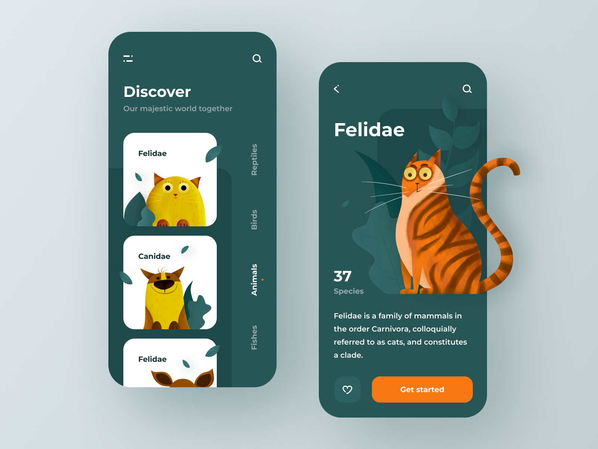

# animals_app

El ejercicio era replicar esta proyecto:

## Criterios de Evaluación

### 1. Diseño

- No afectan el puntaje los siguientes elementos: menú vertical, botón de búsqueda en la pantalla de detalle, botones inferiores en la pantalla de detalle y la planta de fondo detrás del gato número 37 y Species.
- Donde dice Felidae -> debe mostrar el tipo de animal (Perro, Gato, León, etc).

### 2. Responsividad

- La aplicación debe verse bien en todos los dispositivos (sin desbordamientos).

### 3. Sonido

- El sonido de cada animal debe ser reproducible.

### 4. Imágenes

- Las imágenes de los animales deben ser visibles dentro del componente de desplazamiento y en la pantalla de detalle.

### Se evaluará en el código

- Utilización de componentes
- Separación de componentes
- Claridad del código

## Getting Started

This project is a starting point for a Flutter application.

A few resources to get you started if this is your first Flutter project:

- [Lab: Write your first Flutter app](https://docs.flutter.dev/get-started/codelab)
- [Cookbook: Useful Flutter samples](https://docs.flutter.dev/cookbook)

For help getting started with Flutter development, view the
[online documentation](https://docs.flutter.dev/), which offers tutorials,
samples, guidance on mobile development, and a full API reference.
